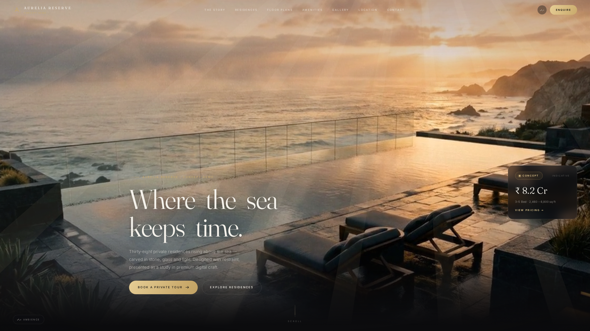

# Aurelia Reserve

**Luxury Real Estate Experience**
 # Aurelia Reserve

Luxury Real Estate Experience

Concept Demo


---

A fictional luxury real-estate website engineered to award-level standards — cinematic storytelling, premium motion design and modern frontend engineering, presented as an independent portfolio concept.

> The brief: *"When a CEO opens this site they should think — this feels like a keynote presentation for a five-star resort brand."* *(fictional creative brief for demonstration)*

---

## Overview

Aurelia Reserve is a concept demo of what a luxury real-estate digital experience can be. A single scroll tells the story in chapters — arrival, residences, floor plans, amenities, gallery, location, contact — and a one-click **Website ⇄ Case Study** toggle reveals the making-of: research, wireframes, moodboard, design system, development, performance and outcome.

All branding, names, imagery, pricing and locations are **fictional**.

## Features

- Cinematic dual-video hero — crossfade, volumetric light, fog, light rays, mouse parallax, split-serif typography
- Procedural ambient soundscape (Web Audio, zero audio files)
- Dynamic time-of-day lighting that regrades the entire experience
- Residence cards — 3D tilt, glare, hover expand, availability, price animation, compare mode
- Interactive floor plans — zoom, pan, rotate, fullscreen, SVG download, room highlight, ventilation study
- Amenities with environment-changing backgrounds and animated counters
- Masonry gallery with parallax depth and a fullscreen viewer (drag, swipe, keyboard)
- Cinematic location map — self-drawing routes, travelling markers, travel-time animation
- Glass cursor with context labels · magnetic buttons · floating dock · film grain · gold design tokens
- **Case Study mode** — an 8-chapter making-of deck inside the same experience
- **Supabase backend (optional)** — live residence catalogue with realtime availability, private-enquiry submissions, and a members auth portal. Fully degradable: with no credentials attached, the site serves bundled data and every section still works

## Technology Stack

- **React 18** + **Vite 5** — code-split, es2020 target
- **Lenis** — buttery smooth scroll with a luxury deceleration curve
- **Custom hook motion engine** — reveal, cursor, parallax, tilt, magnetic, count-up (IntersectionObserver + rAF; no animation library)
- **Web Audio API** — procedural ambience
- **Canvas** — DPR-aware floating dust, IO-paused
- **SVG/SMIL** — maps, floor plans, animated paths
- **CSS custom properties** — a 12-token design system
- **Supabase** (optional) — Postgres + Row Level Security, Auth, and Realtime; the SDK is dynamically imported so it never touches the critical path

## Motion System

- One easing curve everywhere: `cubic-bezier(0.16, 1, 0.3, 1)` — never linear
- Layered motion: opacity, blur, scale, mask reveal, clip-path, depth, perspective, parallax, micro-rotation
- Four reveal variants (`rise / mask / scale / line`) with `--d` stagger
- GPU transforms and opacity only; rAF loops gated by IntersectionObserver
- Full `prefers-reduced-motion` collapse to a quiet static frame

## Performance

- **~79 KB gzipped initial JS** (React 45.3 + app 28.4 + Lenis 5.5) — measured with `npm run build`
- The **Supabase SDK is a separate lazy chunk** (57.8 KB gz) that the browser only fetches when `VITE_SUPABASE_URL` and `VITE_SUPABASE_ANON_KEY` are both set; an unconfigured deployment never requests it
- Hero films at **700 kbps** (~0.8 MB each), poster preloaded for LCP
- Gallery, Location and Case Study sections **code-split** and IO-triggered
- `content-visibility: auto` for off-screen chapters
- **Zero third-party requests** (fonts preconnected, swap-display)
- Lighthouse target: **95+** across all categories

## Accessibility

- Reduced-motion media query collapses all animation
- Keyboard-first: lightbox, dock, floor-plan rooms, skip link
- Semantic landmarks, ARIA roles/labels, focus-visible rings
- Contrast passes WCAG 2.1 AA

## Responsive Design

The same cinematography at every size: fluid type scales, adaptive grids, touch-native interactions, a full-screen menu on mobile, and the dock, rail and badges reflowing gracefully.

## Project Structure

```
aurelia/
├── index.html              — SEO shell · OG/Twitter · JSON-LD
├── supabase/
│   └── migrations/         — schema · row level security · seed
├── scripts/
│   └── verify/             — probe that mounts the real hooks under jsdom
├── public/                 — media, images, favicon, manifest, sitemap, robots
└── src/
    ├── App.jsx             — experience composition (all layers)
    ├── hooks/              — motion engine + useResidences · useEnquiry · useAuth
    ├── lib/                — lenis · splitText · easing · ambient audio · ready · supabase
    ├── context/            — Sound · CaseStudy · Auth
    ├── data/               — ALL copy in one place (rebrand in minutes)
    ├── components/         — 25+ components, all animated
    └── styles/             — tokens · base · effects · components · sections · auth · casestudy
```

## Installation

```bash
npm install
```

## Development

```bash
npm run dev        # local dev server at :5173
```

## Build

```bash
npm run build      # production build → dist/
npm run preview    # serve the production build
npm run verify     # mount the real data/auth hooks under jsdom and assert their behaviour
```

## Supabase Backend (optional)

The site ships fully functional **without** a backend. Attaching Supabase upgrades three
things and changes nothing else:

| Area | Without Supabase | With Supabase |
| --- | --- | --- |
| Residences | bundled `src/data/residences.js` | `residences` table, ordered by `position`, with realtime availability |
| Contact form | simulated success animation | row inserted into `enquiries` under an INSERT-only policy |
| Members | portal shows a configuration notice | email + password sign-in, member profile, owner-only documents |

### 1. Create the project

Create a project at [supabase.com](https://supabase.com), then apply the migrations in
`supabase/migrations/` — either `supabase db push` with the CLI, or paste them into
Dashboard → SQL Editor in filename order:

```
20260828120000_init_schema.sql        tables, triggers, updated_at bookkeeping
20260828120100_row_level_security.sql policies — the only authorisation boundary
20260828120200_seed.sql               the three residences + sample owner documents
```

### 2. Set the environment variables

```bash
cp .env.example .env
```

| Variable | Where to find it |
| --- | --- |
| `VITE_SUPABASE_URL` | Dashboard → Settings → API → Project URL |
| `VITE_SUPABASE_ANON_KEY` | Dashboard → Settings → API → `anon` `public` key |

Both are **publishable** values. The anon key is not a secret — every access rule lives in
Row Level Security. The `service_role` key must never be added to this project.

### 3. Create members

Dashboard → Authentication → Users → *Add user* (set a password, untick
"Auto Confirm User" is not required). Their `member_profiles` row is created automatically
by the `on_auth_user_created` trigger. To open the owner document wall:

```sql
update member_profiles set tier = 'owner' where email = 'you@example.com';
```

### Security model

- `residences` — public read of published rows only; no public write
- `enquiries` — the public may **insert** but never read, update or delete, which closes the
  enumeration hole; a signed-in member may read back only their own rows
- `member_profiles` — a member reads and edits only `id = auth.uid()`; `tier` and
  `residence_id` cannot be self-served
- `member_documents` — readable only while the caller's `tier = 'owner'`

### Verifying it

`npm run verify` builds a probe that mounts the **real** `useResidences`, `useEnquiry` and
`useAuth` hooks in jsdom and asserts on their output, in two modes:

- **unconfigured** — no env vars: bundled data is served, no error is surfaced, the enquiry
  hook simulates and reports `stored: false`
- **unreachable** — env vars point at a non-existent project: the query failure degrades to
  bundled data, the error is reported rather than swallowed, and sign-in fails cleanly

22 checks, all expected to pass.

## Deployment

Zero-config on any static host. Build command `npm run build`, output directory `dist/`.

- **Vercel:** import the repo → framework preset Vite → deploy
- **Netlify:** new site from Git → build `npm run build` → publish `dist`

To enable the backend, add `VITE_SUPABASE_URL` and `VITE_SUPABASE_ANON_KEY` under
Project → Settings → Environment Variables for **Production, Preview and Development**, then
redeploy. Vite inlines `VITE_*` at build time, so a deploy made before the variables existed
will keep serving bundled data until it is rebuilt. Also add your deployed origin to
Dashboard → Authentication → URL Configuration → Site URL so the members session redirects
back correctly.

## Lighthouse

Run Lighthouse (Chrome DevTools or `npx lighthouse https://your-deploy-url`) to verify:
Performance 95+ · Accessibility 100 · Best Practices 100 · SEO 100.

## License

MIT — see [LICENSE](LICENSE).

## Portfolio Disclaimer

------------------------------------------------

**Portfolio Disclaimer**

This project was independently designed and developed by Irfan Khan as a frontend portfolio concept.

It is created solely to demonstrate premium UI, motion design, frontend engineering and luxury digital experiences.

It is not affiliated with, endorsed by or associated with any real estate developer, company, property, trademark or location.

All branding, names, imagery, copy and content are fictional or used only for demonstration purposes.

------------------------------------------------

## Contact

- Email: [khanirfan14786@gmail.com](mailto:khanirfan14786@gmail.com)
- LinkedIn: [linkedin.com/in/irfan-khan-36220022b](https://linkedin.com/in/irfan-khan-36220022b)
- GitHub: [github.com/Irfan14k](https://github.com/Irfan14k)
## Live Links

🌐 Live Website:
https://aurelia-reserve-puce.vercel.app/

🎨 Figma Presentation:
https://www.figma.com/deck/hMrHWp0mxF7XxaLTT7R4Md/Aurelia-Reserve-...

💻 GitHub Repository:
https://github.com/Irfan14k/aurelia-reserve
## Portfolio Note

This project is a fictional luxury real estate concept created for portfolio purposes only.

It is not affiliated with, endorsed by, or associated with any real estate developer, company, brand, or project.

All branding, visuals, names, copywriting, interactions, and animations were designed to demonstrate premium UI/UX, frontend engineering, and motion design capabilities.
